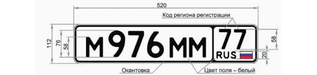
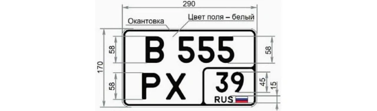
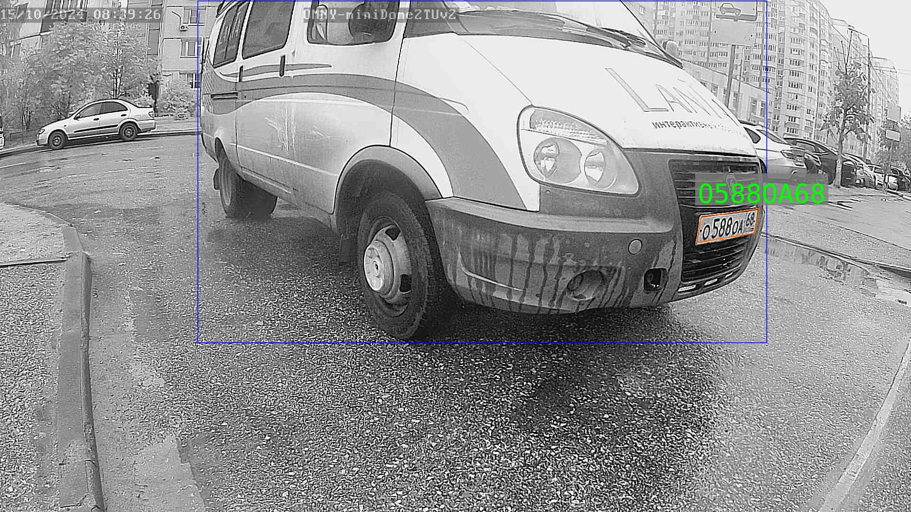
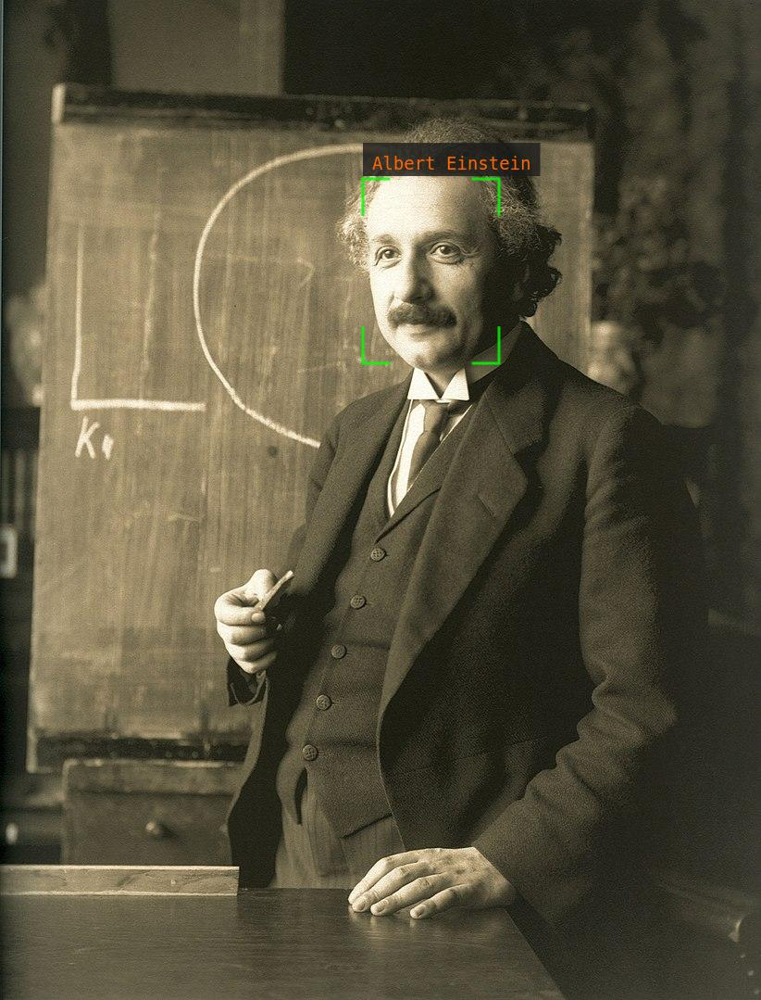

## [](./README_ru.md) Description of the FALPRS project
This project is a replacement for the [old](https://github.com/rosteleset/frs) one. Main differences:
* PostgreSQL is used as a DBMS.
* The project uses [userver](https://github.com/userver-framework/userver), an open-source asynchronous framework.
* Strict adherence to data types in [API](https://rosteleset.github.io/falprs/) requests. For example, if a numeric field is expected, it cannot be enclosed in quotation marks.
* Added a license plate recognition system (LPRS).

### Content
* [LPRS](#lprs)
  * [Neural network models used](#lprs_used_dnn)
  * [General scheme of interaction with LPRS](#lprs_scheme)
  * [Automatic number ban](#lprs_auto_ban)
* [FRS](#frs)
  * [Neural network models used](#frs_used_dnn)
  * [General scheme of interaction with FRS](#frs_scheme)
* [Building and setting up the project](#build_and_setup_falprs)
   * [System requirements](#system_requirements)
   * [Installing NVIDIA drivers](#install_drivers)
   * [Installing Docker Engine](#install_de)
   * [Installing NVIDIA Container Toolkit](#install_ct)
   * [Installing PostgreSQL](#install_pg)
   * [Building the project](#build_falprs)
   * [Creating TensorRT neural network model plans](#create_models)
   * [Project configuration](#config_falprs)
   * [Managing video stream groups](#vstream_groups)
* [Examples](#examples)
   * [LPRS](#lprs_examples)
   * [FRS](#frs_examples)
* [Tests](#tests)
   * [LPRS](#lprs_tests)
   * [FRS](#frs_tests)
 * [Synchronizing data with an old FRS project](#frs_sync_data)

<a id="lprs"></a>
## LPRS
The system is designed to recognize license plates and detect special vehicles with flashing lights: ambulance, emergency, police, etc. Currently, Russian registration plates of type 1 (ГОСТ Р 50577-93) and 1А (ГОСТ Р 50577-2018) are supported:



<a id="lprs_used_dnn"></a>
### Neural network models used
The service works with four neural networks: VDNet, VCNet, LPDNet and LPRNet. VDNet is designed to search for vehicles using a received image from a video camera. VCNet determines whether each vehicle found is a special one. LPDNet is designed to search for license plates. LPRNet is designed to recognize license plates from data received by LPDNet. VDNet, LPDNet and LPRNet models are trained using [Ultralytics](https://github.com/ultralytics/ultralytics). The VCNet model was obtained by transfer learning with fine-tuning. Based on [this](https://huggingface.co/WinKawaks/vit-small-patch16-224) model.
[NVIDIA Triton Inference Server](https://developer.nvidia.com/triton-inference-server) is used for inference of neural networks.

<a id="lprs_scheme"></a>
### General scheme of interaction with LPRS 
 To interact with the service, an [API](https://rosteleset.github.io/falprs/) is used, a detailed description of which is in the repository in the file **docs/openapi.yaml**. First you need to register the video streams that the system will work with. The API method **addStream** is used for this. Main parameters:
 - **streamId** - internal for your backend (external for LPRS) video stream identifier;
 - **config** - configuration parameters.
Example request body:
```json
{
  "streamId": "1234",
  "config": {
    "screenshot-url": "https://my.video.stream/capture",
    "callback-url": "https://my.host/callback?streamId=1"
  }
}
```
Now LPRS knows that frames should be captured using the specified **screenshot-url** parameter, and when a special vehicle is detected or license plate recognition is detected, a short HTTP information should be sent using the POST method to **callback-url**.
In order for LPRS to process frames, you need to call the **startWorkflow** API method.
Example request body:
```json
{
  "streamId": "1234"
}
```
The system will begin a cyclical process: receiving a frame, processing it using neural networks, sending, if required, information to **callback-url**. Pause for a while and again receive the frame, process it, etc. To stop the process, you need to call the **stopWorkflow** API method.
Example request body:
```json
{
  "streamId": "1234"
}
```
To reduce the load on the system, we recommend calling **startWorkflow** and **stopWorkflow**, for example, according to camera video analytics: motion detection, line crossing, intrusion detection, etc. When receiving brief information about recognized license plates, your backend must process it. For example, check the received numbers with the list of allowed ones and open the gate or simply ignore them. License plate recognition events are stored in LPRS for some time. If complete information about an event is required, then you need to use the **getEventData** API method.
To remove a video stream, use the **removeStream** API method. Using **listStreams** you can get information about video streams registered in LPRS.

<a id="lprs_auto_ban"></a>
### Automatic number ban
To prevent spam requests to **callback-url**, a two-stage number ban is used. If the system sees the number for the first time, then after processing it will be at the first stage of the ban: for some time (configuration parameter **ban-duration**), the number is ignored, regardless of its location in the frame. If the system sees this number again at the first stage, the ban time will be extended. At the end of the first stage, the number will be included in the next one. At the second stage of the ban (configuration parameter **ban-duration-area**), the number is ignored until it changes its location in the frame. When changing the location (configuration parameter **ban-iou-threshold**), the number will be processed and will again go to the first stage. At the end of the second stage, the number is removed from the ban. If you do not want automatic banning of numbers to be applied, then you need to set the value of the **ban-duration** or **ban-duration-area** configuration parameter to a zero value, for example 0s (0 seconds).

<a id="frs"></a>
## FRS
The system is designed for facial recognition.

<a id="frs_used_dnn"></a>
### Neural network models used
At the moment, FRS uses three models in its work:
- **scrfd** - designed to search for faces in an image. [Link](https://github.com/deepinsight/insightface/tree/master/detection/scrfd) to the project.
- **genet** - designed to determine whether a mask or dark glasses is on the face. Based on [this](https://github.com/idstcv/GPU-Efficient-Networks) project. The model was obtained by transfer learning with fine-tuning on three classes: an open face, a face in a mask, a face in dark glasses.
- **arcface** - designed to calculate a biometric face template. [Link](https://github.com/deepinsight/insightface/tree/master/recognition/arcface_torch) to the project.

<a id="frs_scheme"></a>
### General scheme of interaction with FRS
To interact with the service, an [API](https://rosteleset.github.io/falprs/) is used, a detailed description of which is in the repository in the file **docs/openapi.yaml**. First of all, your backend registers video streams using the **addStream** API call. The main parameters of the method are:
- **streamId** - internal for the backend (external for FRS) identifier of the video stream;
- **url** is the URL for capturing a frame from the video stream. FRS does not decode video, but works with individual frames (screenshots). For example, the URL might look like ***http://hostname/cgi-bin/images_cgi?channel=0&user=admin&pwd=password***
- **callback** is the URL that FRS will use when recognizing a registered person. For example, ***http://backend-address/face_recognized?stream_id=1***

To register faces, the **registerFace** method is used. Main parameters of the method:
- **streamId** - video stream identifier;
- **url** is the URL of the face you want to register. For example, ***http://backend-address/image_to_register.jpg***
In case of successful registration, the internal for FRS (external for the backend) unique identifier of the registered person - **faceId** - is returned.

To start and end frame processing, the **motionDetection** method is used. The main idea is for FRS to process frames only when motion is detected in front of the video camera. Method parameters:
- **streamId** - video stream identifier;
- **start** - sign of the beginning or end of movement. If **start=true**, then FRS starts processing a frame from the video stream every second (set by the *delay-between-frames* parameter). If **start=false**, then FRS stops processing.

Frame processing means the following chain of actions:
1. Finding faces using the *scrfd* neural network.
2. If faces are found, then each one is checked for “blur” and “frontality”.
3. If the face is not blurred (clear image) and is frontal, then the presence of a mask and dark glasses is determined using the *genet* neural network.
4. For each face without a mask and without dark glasses, using the *arcface* neural network, a biometric face template, also known as a descriptor, is calculated. Mathematically, a descriptor is a 512-dimensional vector.
5. Next, each such descriptor is compared in pairs with those registered in the system. The comparison is made by calculating the cosine of the angle between the descriptor vectors: the closer the value is to one, the more similar the face is to the registered one. If the maximum cosine value is greater than the threshold value (*tolerance* parameter), then the face is considered recognized and FRS calls a callback (face recognition event) and specifies the descriptor identifier (*faceId*) and the internal identifier for FRS (external for the backend) as parameters events (*eventId*). If there are several recognized faces in one frame, then the callback will be called for the highest quality ("best") face (*blur* parameter).
6. Every unblurred, frontal, maskless, sunglasses-free, best face found is temporarily stored in the FRS log.

Using the **bestQuality** method, you can request the “best” frame from the log from FRS. For example, a person unfamiliar to the system approached the intercom and opened the door with a key. The backend knows the opening time with the key (date) and requests the best frame from FRS. FRS looks in its log for a frame with the maximum *blur* from the time range [date - best-quality-interval-before; date + best-quality-interval-after] and produces it as a result. Such a frame is a good candidate for registering a face using the **registerFace** method. As a rule, for good recognition it is necessary to register several faces of one person, including from frames taken in the dark, when the camera switches to infrared operating mode.

<a id="build_and_setup_falprs"></a>
## Building and setting up the project
<a id="system_requirements"></a>
### System requirements
* CPU with AVX instructions.
* NVIDIA GPU with Compute Capability greater than or equal to 6.0 and 4 GB memory or more. Details can be found, for example, [here](https://developer.nvidia.com/cuda-gpus).
* DBMS PostgreSQL 14 or higher.

To get the source code you need git. If not installed, then run the command:
```bash
sudo apt-get install -y git
```
Getting the project source code:
```bash
cd ~
git clone --recurse-submodules https://github.com/rosteleset/falprs.git
```
<a id="install_drivers"></a>
### Installing NVIDIA drivers
If the system already has the latest NVIDIA drivers installed, skip this step. To install, you can use the script **scripts/setup_nvidia_drivers.sh**. Basic commands taken from [here](https://docs.nvidia.com/datacenter/tesla/driver-installation-guide/index.html#ubuntu).
```bash
sudo ~/falprs/scripts/setup_nvidia_drivers.sh
```
After installation, you need to restart the operating system:
```bash
sudo reboot
```

<a id="install_de"></a>
### Installing Docker Engine
If Docker Engine is already installed on the system, then skip this step. To install, you can use the script **scripts/setup_docker.sh**. Basic commands taken from [here](https://docs.docker.com/engine/install/ubuntu/#install-using-the-repository).
```bash
sudo ~/falprs/scripts/setup_docker.sh
```

<a id="install_ct"></a>
### Installing NVIDIA Container Toolkit
If NVIDIA Container Toolkit is already installed on the system, then skip this step. To install, you can use the script **scripts/setup_nvidia_container_toolkit.sh**. Basic commands taken from [here](https://docs.nvidia.com/datacenter/cloud-native/container-toolkit/latest/install-guide.html).
```bash
sudo ~/falprs/scripts/setup_nvidia_container_toolkit.sh
```
After installation, you are prompted to restart docker:
```bash
sudo systemctl restart docker
```

<a id="install_pg"></a>
### Установка PostgreSQL
If PostgreSQL is not installed, then run the command:
```.bash
sudo apt-get install -y postgresql
```
Run psql:
```bash
sudo -u postgres psql
```
Run the SQL commands, specifying your password instead of "123":
```sql
drop user if exists falprs;
create user falprs with encrypted password '123';
create database frs;
grant all on database frs to falprs;
alter database frs owner to falprs;
create database lprs;
grant all on database lprs to falprs;
alter database lprs owner to falprs;
\q
```

<a id="build_falprs"></a>
### Building the project
To build the project, you can use the script **scripts/build_falprs.sh**. The major PostgreSQL version is set by the **PG_VERSION** variable. You can find out the installed version of PostgreSQL with the command:
```bash
psql --version
```
The project's working directory is specified by the **FALPRS_WORKDIR** variable (default value */opt/falprs*), the version of the container with Triton Inference Server is specified by the **TRITON_VERSION** variable.

##### Compute Capability and Latest Container Version Support Matrix
|Compute Capability|GPU Architecture|Container Version|TensorRT|
|--|--|--|--|
|6.x|Pascal|24.04|8.6.3|
|7.0|Volta|24.09|10.4.0.26|

View Compute Capability:
```bash
nvidia-smi --query-gpu=compute_cap --format=csv
```
If you have a GPU with Compute Capability 7.5 or higher, you can use the latest version of the [container](https://catalog.ngc.nvidia.com/orgs/nvidia/containers/tritonserver/tags). For example, build for Ubuntu 24.04 and GPU with Volta architecture:
```bash
sudo PG_VERSION=16 TRITON_VERSION=24.09 ~/falprs/scripts/build_falprs.sh
```

<a id="create_models"></a>
### Creating TensorRT neural network model plans
For inference, TensorRT plans are used, which can be obtained from neural network models in the ONNX (Open Neural Network Exchange) format. To create plans in the working directory, you can use the script **scripts/tensorrt_plans.py**. The project's working directory is specified by the **FALPRS_WORKDIR** variable (default value */opt/falprs*), the Triton Inference Server version is specified by the **TRITON_VERSION** variable.
**Important:** if you are migrating from an old project, you also need to use the *sha1sum* utility to specify the hash sum of the ONNX file that you used to create the TensorRT *arcface* model plan. This value is specified in the **ARCFACE_SHA1** variable.
Example of execution without migration:
```bash
sudo TRITON_VERSION=24.09 python3 ~/falprs/scripts/tensorrt_plans.py
```
Examples of execution with migration for the old file *glint_r50.onnx*. Calculating the hash sum:
```bash
sha1sum glint_r50.onnx
4fd7dce20b6987ba89910eda8614a33eb3593216  glint_r50.onnx
```
Creating TensorRT plans:
```bash
sudo TRITON_VERSION=24.09 ARCFACE_SHA1=4fd7dce20b6987ba89910eda8614a33eb3593216 python3 ~/falprs/scripts/tensorrt_plans.py
```

<a id="config_falprs"></a>
### Project configuration
To initially populate the databases, run the commands, specifying the values ​​of the variables with the prefix **pg_** (replace the password “123” with the one you specified when creating the PostgreSQL user):
```bash
pg_user=falprs pg_passwd=123 pg_host=localhost pg_port=5432 pg_db=frs ~/falprs/scripts/sql_frs.sh
pg_user=falprs pg_passwd=123 pg_host=localhost pg_port=5432 pg_db=lprs ~/falprs/scripts/sql_lprs.sh
```
The project configuration is in the file **/opt/falprs/config.yaml**
The main parameters have a description in the comments. Some values ​​need to be replaced.
* In the sections *components_manager -> components -> lprs-postgresql-database* and *components_manager -> components -> frs-postgresql-database* in the values ​​of the **dbconnection** attributes, replace the password "123" with the one you specified when creating the PostgreSQL user, as well as other access details, if they differ.
* In the *components_manager -> task_processors -> main-task-processor* section, replace the **worker_threads** value with the number of CPU cores of your server. The quantity can be viewed, for example, using the command:
```bash
cat /proc/cpuinfo | grep processor | wc -l
```
* In the *components_manager -> task_processors -> fs-task-processor* section, replace the **worker_threads** value with the number of CPUs on your server multiplied by 4.

To start a container with **Triton Inference Server** run the command:
```bash
sudo TRITON_VERSION=24.09 ~/falprs/scripts/triton_service.sh
```
To create the **falprs** service and rotate logs, run the command:
```bash
sudo ~/falprs/scripts/falprs_service.sh
```

<a id="vstream_groups"></a>
### Managing video stream groups
Each video stream belongs to a single group. When filling in the initial data, a group named *default* is automatically created. When calling API methods for this group, you do not have to specify an authorization token. To view, add, and delete groups, you can use the **utils/vstream_groups.py** script.
Installing dependencies:
```bash
sudo apt-get install -y python3-psycopg2 python3-prettytable
```
Show list of commands:
```bash
python3 ~/falprs/utils/vstream_groups.py -h
```
Example of adding a new group to FRS:
```bash
python3 ~/falprs/utils/vstream_groups.py -t frs -a "My new group"
```
Show list of groups in LPRS:
```bash
python3 ~/falprs/utils/vstream_groups.py -t lprs -l
```
Example output:
```bash
+----------+--------------+--------------------------------------+
| id_group |  group_name  |              auth_token              |
+----------+--------------+--------------------------------------+
|    1     |   default    | 4b05cce8-d29e-4e7f-a1fa-247a91f3fd46 |
|    2     | My new group | 74c0e0f0-ea70-47fb-b715-8932baf7e049 |
+----------+--------------+--------------------------------------+
```
When calling API methods for new groups, you must specify an authorization token. If you want the authorization token to become mandatory for the default group, then set the value 0 for the *allow-group-id-without-auth* parameters in the corresponding sections of the project configuration file (*/opt/falprs/config.yaml*) and restart the service.

<a id="examples"></a>
## Examples
Installing dependencies:
```bash
sudo apt-get install -y nodejs npm libcairo2-dev libpango1.0-dev libjpeg-dev libgif-dev librsvg2-dev
```

<a id="lprs_examples"></a>
### LPRS
Go to the directory with examples:
```bash
cd ~/falprs/examples/lprs
```
Installing dependencies:
```bash
npm i
```
Launch a test service to process callbacks:
```bash
node lprs_backend.js
```
Add a “test” video stream. In the new console:
```bash
cd ~/falprs/examples/lprs
./test_add_stream.sh
```
Check that the stream is in the database:
```bash
./test_list_streams.sh | jq
```
The response must contain a json file. Wait a minute for new data to appear in the FALPRS cache, execute the command:
```bash
./test_workflow.sh
```
As a result of executing this command in the console with the test service *lprs_backend.js*, we should see lines like:
```bash
[2024-10-16 12:37:16.108] Callback: {"streamId":"test001","date":"2024-10-16T09:37:16.103891056+00:00","eventId":1,"plates":["O588OA68"],"hasSpecial":false}
[2024-10-16 12:37:16.108] Matched numbers: O588OA68
[2024-10-16 12:37:16.162] Save image to file: /tmp/lprs_backend/screenshots/49b507ac-9b7d-43a6-94f0-18f647fc1f5c.jpg
```
And in the directory */tmp/lprs_backend/screenshots* a file with an image should appear:


Deleting the “test” video stream:
```bash
./test_remove_stream.sh
```
Go to the console from which we launched the test service to process callbacks and stop it.

<a id="frs_examples"></a>
### FRS
Go to the directory with examples:
```bash
cd ~/falprs/examples/frs
```
Installing dependencies:
```bash
npm i
```
Launch a test service to process callbacks:
```bash
node frs_backend.js
```
Add a “test” video stream. In the new console:
```bash
cd ~/falprs/examples/frs
./test_add_stream.sh
```
Check that the stream is in the database:
```bash
./test_list_streams.sh | jq
```
The response must contain a json file. Wait 10 seconds for the new data to enter the FALPRS cache, and execute the face registration command:
```bash
./test_register_face.sh
```
Check that the person is in the database:
```bash
./test_list_all_faces.sh | jq
```
The response must contain a json file. Wait 10 seconds for the new data to enter the FALPRS cache, execute the command:
```bash
./test_workflow.sh
```
As a result of executing this command in the console with the test service *frs_backend.js*, we should see lines like:
```bash
[2024-10-21 15:34:29.180] Callback: {"faceId":1,"eventId":1}
[2024-10-21 15:34:29.180] This is Albert Einstein
[2024-10-21 15:34:29.220] Save image to file: /tmp/frs_backend/screenshots/492d7722d038434d9e2676648991e65e.jpg
```
And in the directory */tmp/frs_backend/screenshots* a file with an image should appear:


<a id="tests"></a>
## Tests
Installing dependencies:
```bash
sudo apt-get install -y python3-requests python3-pytest python3-pytest-order
```
Creating directories and test databases:
```bash
cd ~/falprs/tests
./test_prepare.sh
```

<a id="lprs_tests"></a>
### LPRS
```bash
pytest -v -s test_api_lprs.py
```

<a id="frs_tests"></a>
### FRS
```bash
pytest -v -s test_api_frs.py
```
After finishing the tests, delete the directories and test databases:
```bash
./test_clean.sh
```

<a id="frs_sync_data"></a>
### Synchronizing data with an old FRS project
The *sync_data.py* script from the *utils* directory of this repository performs a full synchronization: it deletes unnecessary records in the new database and adds missing ones. Before running the script, make sure that your old service is stopped, and that the new one is correctly configured and stopped. Installing dependencies:
```bash
sudo apt-get install -y pip python3-virtualenv
```
Go to the directory with the script:
```bash
cd ~/falprs/utils
```
Copying the file:
```bash
cp config.sample.py config.py
```
In the *config.py* file, replace the variable values ​​according to your configuration of the old and new service. Variables of the form *mysql_** and *\*_old* refer to the old project, *pg_** and *\*_new* - to the new one. Run the commands:
```bash
virtualenv venv
source venv/bin/activate
pip install -r requirements.txt
python3 sync_data.py
```
After the script runs, a success message should appear.
Delete the virtual environment:
```bash
deactivate
rm -rf ./__pycache__/
rm -rf venv
```
